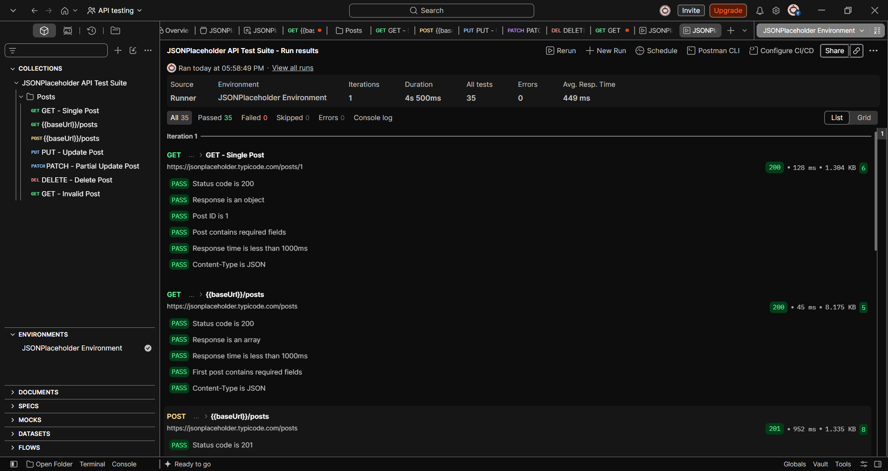
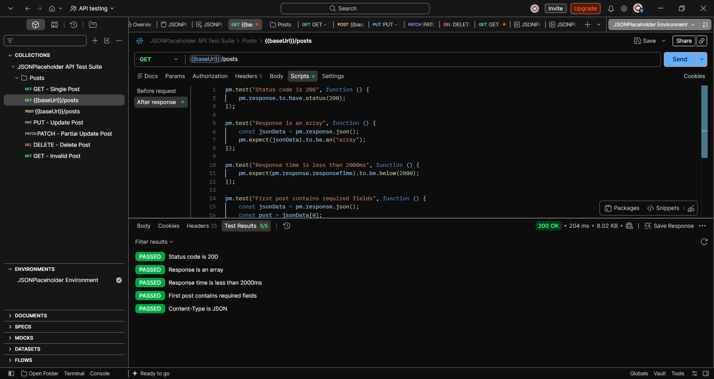
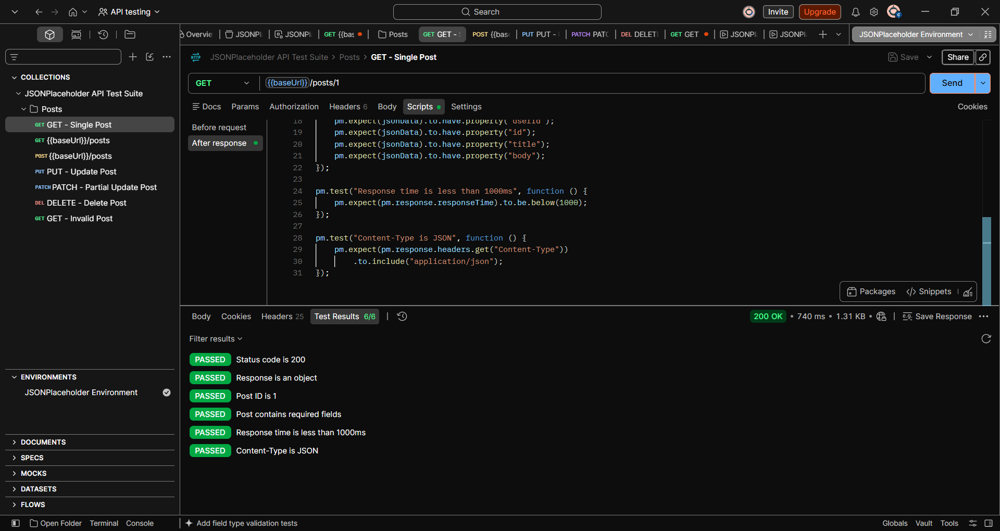
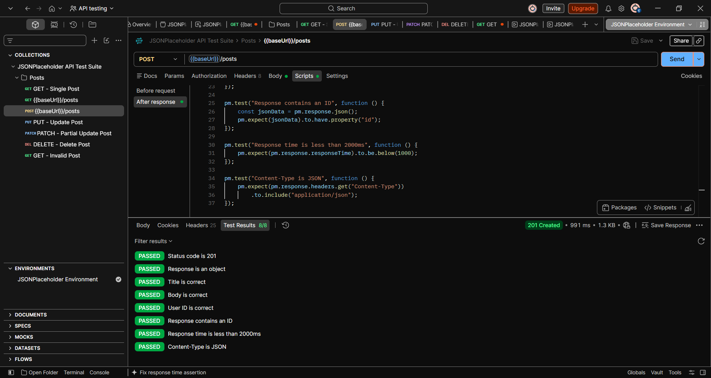
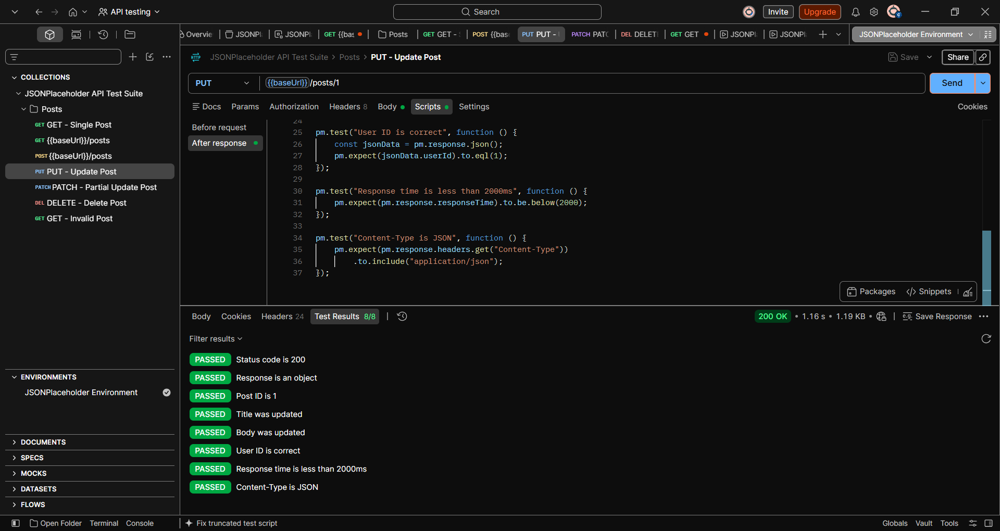
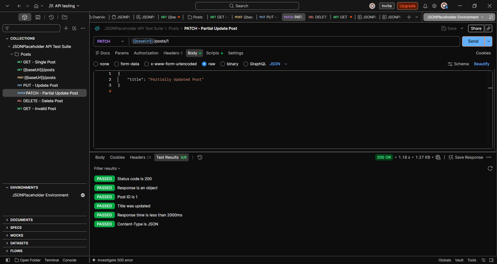
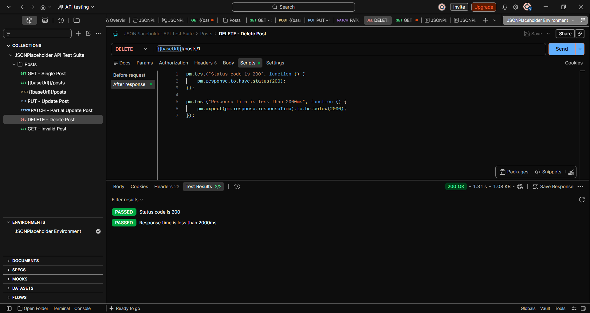
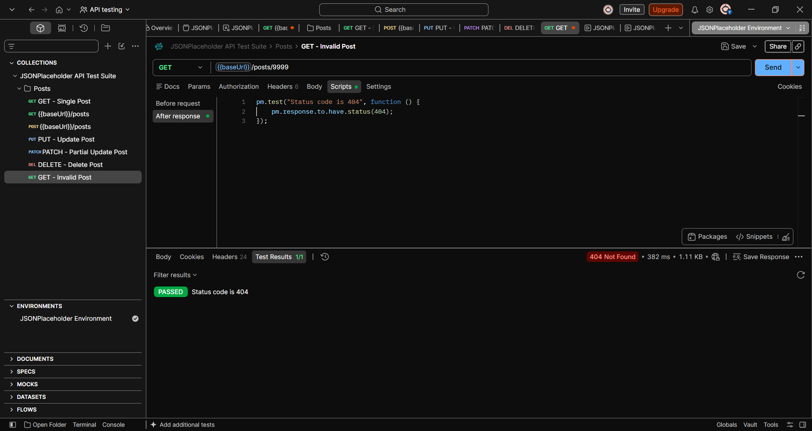

# API Testing with Postman

## 📌 Project Overview

This project demonstrates **REST API testing using Postman** and **JSONPlaceholder**.

The project covers functional API testing, automated test scripts, response validation, HTTP status-code validation, header validation, response-time checks, and positive and negative test scenarios.

The test suite is organized as a reusable **Postman Collection** with documented test cases and test execution results.

---

## 🛠️ Tools & Technologies

- **Postman** – API testing and automation
- **JavaScript** – Automated test scripts
- **REST API** – API architecture
- **JSON** – Request and response data format
- **GitHub** – Version control and project documentation

---

## 🌐 API Under Test

**JSONPlaceholder**

Base URL:

```text
https://jsonplaceholder.typicode.com
```

JSONPlaceholder is a free fake REST API used for testing and development purposes.

---

## 🧪 Test Coverage

| Test ID | Method | Test Scenario | Endpoint | Expected Status |
|---|---|---|---|---:|
| TC001 | GET | Retrieve all posts | `/posts` | 200 |
| TC002 | GET | Retrieve a single post | `/posts/1` | 200 |
| TC003 | POST | Create a new post | `/posts` | 201 |
| TC004 | PUT | Update a complete post | `/posts/1` | 200 |
| TC005 | PATCH | Partially update a post | `/posts/1` | 200 |
| TC006 | DELETE | Delete a post | `/posts/1` | 200 |
| TC007 | GET | Request an invalid post | `/posts/9999` | 404 |

---

## 🔍 Automated Test Validations

Automated test scripts were created in Postman's **After response** section to validate:

- HTTP status codes
- Response body structure
- Required response fields
- Response data values
- Content-Type headers
- Response time
- Positive test scenarios
- Negative test scenarios

---

## 📊 Test Execution Results

The complete Postman Collection was executed using the **Postman Collection Runner**.

| Metric | Result |
|---|---:|
| Requests Executed | 7 |
| Automated Assertions | 35 |
| Tests Passed | 35 |
| Tests Failed | 0 |
| Overall Result | **PASS** |

### Collection Runner Result



---

## 📁 Project Structure

```text
API-Testing-Postman/
│
├── collection/
│   └── JSONPlaceholder-API-Tests.json
│
├── screenshots/
│   └── collection-test-results.png
│
├── test-cases/
│   └── API-Test-Cases.xlsx
│
├── reports/
│   └── test-summary.md
│
└── README.md
```

---

## 📋 Test Case Documentation

Detailed test cases are documented in:

```text
test-cases/API-Test-Cases.xlsx
```

The documentation includes:

- Test ID
- Test case description
- HTTP method
- Endpoint
- Expected status code
- Expected result
- Actual result
- Test status

---

## 📄 Test Execution Report

The test execution summary is available at:

```text
reports/test-summary.md
```

The report contains:

- Test execution results
- Test scenarios
- Validation coverage
- Response-time requirements
- Final execution status

---

## ⚡ Response Time Validation

Response-time assertions were implemented in the Postman test scripts.

The defined requirement is:

```text
Response time < 2000 ms
```

A 2000 ms threshold was used to allow for normal network latency when testing a publicly hosted API.

---

## ✅ Positive Testing

The project includes positive scenarios for:

- Retrieving posts
- Retrieving a specific post
- Creating a post
- Updating a post using PUT
- Partially updating a post using PATCH
- Sending a DELETE request

---

## ❌ Negative Testing

A negative test scenario was implemented by requesting a post that does not exist:

```text
GET /posts/9999
```

Expected response:

```text
404 Not Found
```

The test successfully validated the expected error status.

---

## 🔄 HTTP Methods Tested

### GET

Used to retrieve resources from the API.

```text
GET /posts
GET /posts/1
GET /posts/9999
```

### POST

Used to create a new post.

```text
POST /posts
```

### PUT

Used to update a complete post.

```text
PUT /posts/1
```

### PATCH

Used to partially update a post.

```text
PATCH /posts/1
```

### DELETE

Used to send a delete request for a post.

```text
DELETE /posts/1
```

---

## 🧩 Example Automated Test

Example of a Postman response validation script:

```javascript
pm.test("Status code is 200", function () {
    pm.response.to.have.status(200);
});

pm.test("Response is an object", function () {
    const jsonData = pm.response.json();
    pm.expect(jsonData).to.be.an("object");
});

pm.test("Post ID is 1", function () {
    const jsonData = pm.response.json();
    pm.expect(jsonData.id).to.eql(1);
});

pm.test("Content-Type is JSON", function () {
    pm.expect(pm.response.headers.get("Content-Type"))
        .to.include("application/json");
});
```

---

## 📸 Screenshots

### GET – All Posts



### GET – Single Post



### POST – Create Post



### PUT – Update Post



### PATCH – Partial Update



### DELETE – Delete Post



### Negative Test – Invalid Post



### Collection Runner – Test Execution


---

## ⚠️ API Behavior Note

JSONPlaceholder is a **fake REST API** designed for testing and development.

Therefore, POST, PUT, PATCH, and DELETE requests demonstrate the expected API behavior, but they should not be interpreted as permanent changes to a real production database.

---

## 🎯 Key Learning Outcomes

Through this project, I practiced:

- Designing API test scenarios
- Understanding REST API methods
- Sending HTTP requests using Postman
- Writing JavaScript assertions
- Validating API responses
- Validating HTTP status codes
- Validating response headers
- Performing response-time checks
- Creating positive and negative test scenarios
- Organizing requests into Postman Collections
- Running automated tests using Collection Runner
- Documenting test cases
- Preparing test execution reports
- Maintaining a QA testing project using GitHub

---

## ⭐ Project Summary

This project demonstrates a practical approach to **REST API testing and test automation using Postman**, including API request execution, automated response validation, positive and negative testing, test documentation, and collection-level test execution.
